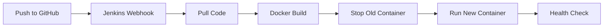

# 🚀 DevOps-Backend: CI/CD Pipeline

[](https://github.com/ShivangChaurasia/CI-CD-Jenkins-Docker)
[](https://hub.docker.com/)
[](https://nodejs.org/)

A professional Node.js backend application integrated with a robust **CI/CD pipeline** using GitHub, Jenkins, and Docker. This project demonstrates automated deployment, containerization, and infrastructure as code practices.

---

## 📌 Project Overview

This project serves as a template for a modern DevOps workflow. Every push to the main branch triggers an automated build and deployment sequence, ensuring that the latest stable version of the application is always running in a containerized environment.

### Key Features
- **Automated CI/CD**: Seamless integration between GitHub and Jenkins.
- **Containerization**: Dockerized application for environment consistency.
- **Micro-service Ready**: Built with Express.js for scalability.
- **Security**: Pre-configured `.gitignore` to protect sensitive data.

---

## ⚙️ Tech Stack

<p align="left">
  
  
  
  
  
</p>

---

## 🔄 CI/CD Pipeline Workflow

The pipeline is designed to be fully autonomous:



1.  **Code Push**: Developers push code to the `main` branch.
2.  **Jenkins Trigger**: Jenkins detects changes via polling or Webhooks.
3.  **Build Phase**: Jenkins executes the `Dockerfile` to create a fresh image.
4.  **Deployment Phase**: 
    - Existing containers are safely stopped.
    - New containers are launched on port `3000`.
5.  **Validation**: The application becomes accessible at `http://localhost:3000`.

---

## 🚀 Getting Started

### Prerequisites
- [Node.js v18+](https://nodejs.org/)
- [Docker](https://www.docker.com/)
- [Jenkins](https://www.jenkins.io/) (configured with Docker plugin)

### Local Development
1. **Clone the repository**:
   ```bash
   git clone https://github.com/ShivangChaurasia/CI-CD-Jenkins-Docker.git
   cd DevOps-Backend
   ```
2. **Install dependencies**:
   ```bash
   npm install
   ```
3. **Run the app**:
   ```bash
   node index.js
   ```

### Docker Deployment
Build and run the container manually:
```bash
# Build the image
docker build -t devops-backend .

# Run the container
docker run -d -p 3000:3000 --name backend-container devops-backend
```

---

## 📁 Project Structure
```text
DevOps-Backend/
├── .github/          # GitHub Actions / Workflows
├── index.js          # Entry point
├── Dockerfile        # Container configuration
├── package.json      # Dependencies & Scripts
└── readme.md         # Documentation
```

---

## 🛡️ License
Distributed under the ISC License. See `package.json` for more information.

---
<p align="center">Made with ❤️ for DevOps Excellence</p>